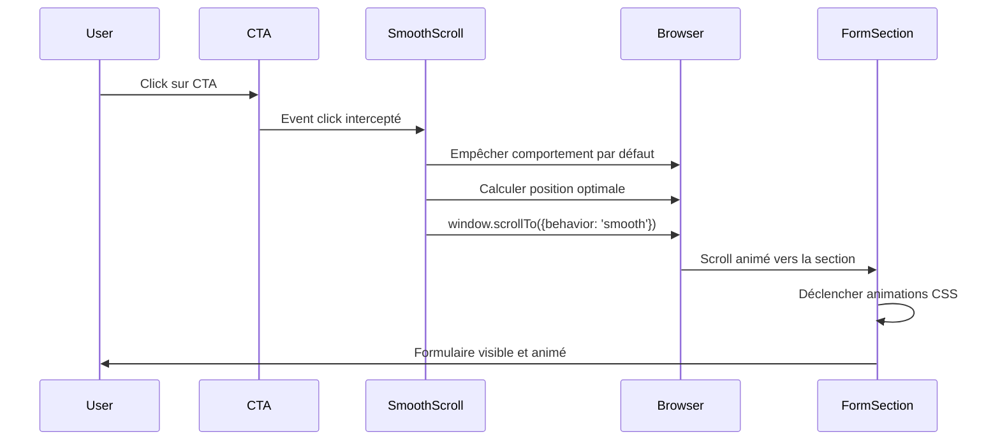

# Design Document: Smooth Scroll to Form

## Overview

Cette fonctionnalité améliore l'expérience utilisateur en fournissant un scroll fluide et optimisé vers le formulaire de diagnostic gratuit. Le système intercepte les clics sur les CTAs avec href="#pricing", calcule la position optimale de scroll en tenant compte de la hauteur du viewport et du header fixe, puis anime le défilement et l'apparition du formulaire.

L'implémentation s'appuie sur le composant `SmoothScroll` existant qui utilise un event listener global pour intercepter les clics sur les liens d'ancrage. Nous allons améliorer ce composant pour :
1. Calculer un centrage vertical optimal du formulaire
2. Appliquer un offset approprié pour le header fixe
3. Ajouter des animations CSS au formulaire lors de son apparition
4. Respecter les préférences d'accessibilité (prefers-reduced-motion)

## Architecture

### Composants impliqués

```
app/layout.tsx
  └── SmoothScroll (composant global)
      ├── Event listener sur document.click
      └── Logique de calcul de position

components/landing/pricing.tsx
  └── Form_Section (id="pricing")
      └── Form_Container (avec classes d'animation)

components/ui/neomorph-cta.tsx
  └── CTA avec href="#pricing"

components/landing/cta-section.tsx
  └── Button avec href="#pricing"
```

### Flux de données



## Components and Interfaces

### 1. SmoothScroll Component (Enhanced)

**Responsabilité**: Intercepter les clics sur les liens d'ancrage et gérer le scroll fluide avec centrage optimal.

**Interface TypeScript**:
```typescript
interface ScrollConfig {
  headerHeight: number;
  targetId: string;
  behavior: ScrollBehavior;
}

interface ScrollPosition {
  top: number;
  behavior: ScrollBehavior;
}

function calculateOptimalScrollPosition(
  targetElement: HTMLElement,
  headerHeight: number
): number;

function shouldReduceMotion(): boolean;
```

**Implémentation**:
```typescript
"use client"

import { useEffect } from "react"

export function SmoothScroll() {
  useEffect(() => {
    // Vérifier les préférences d'accessibilité
    const prefersReducedMotion = window.matchMedia(
      '(prefers-reduced-motion: reduce)'
    ).matches

    const handleClick = (e: MouseEvent) => {
      const target = e.target as HTMLElement
      const link = target.closest('a[href^="#"]')
      
      if (link) {
        const href = link.getAttribute('href')
        if (href && href.startsWith('#')) {
          e.preventDefault()
          const targetId = href.substring(1)
          const targetElement = document.getElementById(targetId)
          
          if (targetElement) {
            const scrollPosition = calculateOptimalScrollPosition(
              targetElement,
              80 // headerHeight
            )
            
            window.scrollTo({
              top: scrollPosition,
              behavior: prefersReducedMotion ? 'auto' : 'smooth'
            })
          }
        }
      }
    }
    
    document.addEventListener('click', handleClick)
    return () => document.removeEventListener('click', handleClick)
  }, [])
  
  return null
}

function calculateOptimalScrollPosition(
  targetElement: HTMLElement,
  headerHeight: number
): number {
  const windowHeight = window.innerHeight
  const elementHeight = targetElement.offsetHeight
  const elementTop = targetElement.offsetTop
  
  // Si l'élément est plus petit que le viewport, le centrer verticalement
  if (elementHeight < windowHeight - headerHeight) {
    const centerPosition = elementTop - (windowHeight - elementHeight) / 2
    return Math.max(0, centerPosition)
  }
  
  // Sinon, positionner le haut juste en dessous du header
  return Math.max(0, elementTop - headerHeight)
}
```

### 2. Pricing Component (Enhanced)

**Responsabilité**: Afficher le formulaire avec des animations CSS lors de l'apparition.

**Classes CSS à ajouter**:
```css
/* Animation de fade-in et slide-up */
@keyframes fadeInUp {
  from {
    opacity: 0;
    transform: translateY(20px);
  }
  to {
    opacity: 1;
    transform: translateY(0);
  }
}

.pricing-form-animate {
  animation: fadeInUp 600ms ease-out forwards;
  animation-play-state: paused;
}

.pricing-form-animate.visible {
  animation-play-state: running;
}

/* Respecter prefers-reduced-motion */
@media (prefers-reduced-motion: reduce) {
  .pricing-form-animate {
    animation: none;
    opacity: 1;
    transform: none;
  }
}
```

**Implémentation React**:
```typescript
"use client"

import { useState, useEffect, useRef } from "react"

export function Pricing() {
  const [isVisible, setIsVisible] = useState(false)
  const sectionRef = useRef<HTMLElement>(null)

  useEffect(() => {
    const observer = new IntersectionObserver(
      ([entry]) => {
        if (entry.isIntersecting) {
          setIsVisible(true)
        }
      },
      {
        threshold: 0.2, // Déclencher quand 20% de la section est visible
        rootMargin: '-80px 0px 0px 0px' // Compenser le header
      }
    )

    if (sectionRef.current) {
      observer.observe(sectionRef.current)
    }

    return () => observer.disconnect()
  }, [])

  return (
    <section 
      id="pricing" 
      ref={sectionRef}
      className="py-24 md:py-32 min-h-screen flex items-center"
    >
      <div className="mx-auto max-w-7xl px-6">
        {/* ... contenu existant ... */}
        
        <div className={`
          pricing-form-container 
          pricing-form-animate 
          ${isVisible ? 'visible' : ''}
        `}>
          {/* Formulaire existant */}
        </div>
      </div>
    </section>
  )
}
```

### 3. Hook personnalisé (optionnel)

**Responsabilité**: Encapsuler la logique de détection de visibilité pour réutilisation.

```typescript
function useScrollAnimation(threshold = 0.2, rootMargin = '-80px 0px 0px 0px') {
  const [isVisible, setIsVisible] = useState(false)
  const ref = useRef<HTMLElement>(null)

  useEffect(() => {
    const observer = new IntersectionObserver(
      ([entry]) => {
        if (entry.isIntersecting) {
          setIsVisible(true)
        }
      },
      { threshold, rootMargin }
    )

    if (ref.current) {
      observer.observe(ref.current)
    }

    return () => observer.disconnect()
  }, [threshold, rootMargin])

  return { ref, isVisible }
}
```

## Data Models

### ScrollConfig

```typescript
interface ScrollConfig {
  // Hauteur du header fixe en pixels
  headerHeight: number;
  
  // ID de l'élément cible (sans le #)
  targetId: string;
  
  // Comportement du scroll ('smooth' | 'auto')
  behavior: ScrollBehavior;
}
```

### ScrollPosition

```typescript
interface ScrollPosition {
  // Position verticale de scroll en pixels
  top: number;
  
  // Comportement du scroll
  behavior: ScrollBehavior;
}
```

### ViewportDimensions

```typescript
interface ViewportDimensions {
  // Hauteur de la fenêtre en pixels
  height: number;
  
  // Largeur de la fenêtre en pixels
  width: number;
}
```

### ElementDimensions

```typescript
interface ElementDimensions {
  // Hauteur de l'élément en pixels
  height: number;
  
  // Position top de l'élément par rapport au document
  offsetTop: number;
}
```


## Correctness Properties

*Une propriété est une caractéristique ou un comportement qui doit être vrai pour toutes les exécutions valides d'un système - essentiellement, une déclaration formelle sur ce que le système doit faire. Les propriétés servent de pont entre les spécifications lisibles par l'humain et les garanties de correction vérifiables par la machine.*

### Property 1: Click interception for anchor links

*Pour tout* lien avec href commençant par "#pricing", quand un utilisateur clique dessus, le système doit intercepter le clic et empêcher le comportement par défaut du navigateur (saut instantané).

**Validates: Requirements 1.1, 1.4, 6.1**

### Property 2: Optimal centering for small sections

*Pour toute* Form_Section dont la hauteur est inférieure à (hauteur du viewport - hauteur du header), la position de scroll calculée doit centrer verticalement la section dans le viewport.

**Validates: Requirements 2.1**

### Property 3: Header-aware positioning for large sections

*Pour toute* Form_Section dont la hauteur est supérieure ou égale à (hauteur du viewport - hauteur du header), la position de scroll calculée doit positionner le haut de la section exactement à (hauteur du header) pixels du haut du viewport.

**Validates: Requirements 2.2**

### Property 4: Offset subtraction in scroll calculation

*Pour tout* calcul de position de scroll, le Scroll_Offset (hauteur du header) doit être soustrait de la position finale calculée.

**Validates: Requirements 3.2**

### Property 5: Non-negative scroll position

*Pour tout* calcul de position de scroll, si le résultat est négatif, la position finale doit être limitée à 0.

**Validates: Requirements 3.4**

### Property 6: Animation trigger on visibility

*Pour toute* Form_Section qui entre dans le viewport (avec au moins 20% visible), la classe CSS 'visible' doit être ajoutée au Form_Container pour déclencher les animations.

**Validates: Requirements 4.1**

### Property 7: Animation state persistence

*Pour tout* Form_Container dont l'animation est terminée, l'état final (opacity: 1, transform: translateY(0)) doit être maintenu indéfiniment.

**Validates: Requirements 4.6**

### Property 8: Viewport resize responsiveness

*Pour tout* événement de redimensionnement du viewport, le prochain calcul de position de scroll doit utiliser les nouvelles dimensions du viewport.

**Validates: Requirements 5.5**

### Property 9: Reduced motion preference

*Pour tout* utilisateur ayant activé la préférence "prefers-reduced-motion", le comportement de scroll doit être 'auto' (instantané) au lieu de 'smooth', et les animations CSS doivent être désactivées.

**Validates: Requirements 7.1**

### Property 10: Event listener cleanup

*Pour tout* démontage du composant SmoothScroll, l'event listener sur document.click doit être supprimé pour éviter les fuites mémoire.

**Validates: Requirements 7.4**

## Error Handling

### 1. Élément cible introuvable

**Scénario**: L'utilisateur clique sur un lien avec href="#pricing" mais l'élément avec id="pricing" n'existe pas dans le DOM.

**Gestion**:
```typescript
if (targetElement) {
  // Procéder au scroll
} else {
  // Ne rien faire, laisser le comportement par défaut
  console.warn(`Target element with id "${targetId}" not found`)
}
```

### 2. Dimensions invalides

**Scénario**: Les calculs de dimensions retournent des valeurs invalides (NaN, undefined).

**Gestion**:
```typescript
function calculateOptimalScrollPosition(
  targetElement: HTMLElement,
  headerHeight: number
): number {
  const windowHeight = window.innerHeight
  const elementHeight = targetElement.offsetHeight
  const elementTop = targetElement.offsetTop
  
  // Validation des dimensions
  if (!isFinite(windowHeight) || !isFinite(elementHeight) || !isFinite(elementTop)) {
    console.error('Invalid dimensions detected')
    return 0 // Position par défaut sûre
  }
  
  // ... reste du calcul
}
```

### 3. Préférence reduced-motion non supportée

**Scénario**: Le navigateur ne supporte pas le media query prefers-reduced-motion.

**Gestion**:
```typescript
const prefersReducedMotion = window.matchMedia(
  '(prefers-reduced-motion: reduce)'
).matches || false // Valeur par défaut si non supporté
```

### 4. IntersectionObserver non supporté

**Scénario**: Le navigateur ne supporte pas l'API IntersectionObserver (très vieux navigateurs).

**Gestion**:
```typescript
useEffect(() => {
  if (!('IntersectionObserver' in window)) {
    // Fallback: afficher directement sans animation
    setIsVisible(true)
    return
  }
  
  const observer = new IntersectionObserver(/* ... */)
  // ... reste du code
}, [])
```

### 5. Scroll interrompu par l'utilisateur

**Scénario**: L'utilisateur scroll manuellement pendant l'animation de smooth scroll.

**Gestion**: Le comportement natif du navigateur avec `behavior: 'smooth'` gère automatiquement l'interruption. Aucune gestion supplémentaire nécessaire.

## Testing Strategy

### Approche de test dual

Cette fonctionnalité nécessite à la fois des tests unitaires et des tests basés sur les propriétés pour une couverture complète :

- **Tests unitaires**: Vérifier des exemples spécifiques, cas limites et conditions d'erreur
- **Tests basés sur les propriétés**: Vérifier les propriétés universelles à travers tous les inputs

### Configuration des tests basés sur les propriétés

**Framework recommandé**: `fast-check` pour TypeScript/JavaScript

**Installation**:
```bash
npm install --save-dev fast-check @testing-library/react @testing-library/jest-dom
```

**Configuration**:
- Minimum 100 itérations par test de propriété (en raison de la randomisation)
- Chaque test de propriété doit référencer sa propriété du document de design
- Format de tag: **Feature: smooth-scroll-to-form, Property {number}: {property_text}**

### Tests unitaires

Les tests unitaires doivent se concentrer sur :

1. **Exemples spécifiques**:
   - Vérifier que le Scroll_Offset de 80px est appliqué (Requirement 3.1)
   - Vérifier que l'animation dure 600ms (Requirement 4.3)
   - Vérifier que la courbe d'animation est ease-out (Requirement 4.5)
   - Vérifier que les propriétés CSS utilisées sont transform et opacity (Requirement 7.3)

2. **Cas limites**:
   - Section exactement de la même taille que le viewport
   - Viewport très petit (mobile)
   - Section très grande (plusieurs écrans)

3. **Conditions d'erreur**:
   - Élément cible introuvable
   - Dimensions invalides (NaN)
   - IntersectionObserver non supporté

### Tests basés sur les propriétés

Les tests de propriétés doivent vérifier :

1. **Property 1**: Click interception
   - Générer différents liens avec href="#pricing"
   - Vérifier que preventDefault est appelé

2. **Property 2**: Optimal centering
   - Générer différentes combinaisons de tailles (viewport, section, header)
   - Vérifier que la formule de centrage est correcte

3. **Property 3**: Header-aware positioning
   - Générer différentes combinaisons de tailles
   - Vérifier que la position est correcte pour les grandes sections

4. **Property 4**: Offset subtraction
   - Générer différentes positions et offsets
   - Vérifier que l'offset est bien soustrait

5. **Property 5**: Non-negative scroll
   - Générer des calculs qui pourraient donner des valeurs négatives
   - Vérifier que le résultat est toujours >= 0

6. **Property 6**: Animation trigger
   - Simuler différents ratios de visibilité
   - Vérifier que la classe est ajoutée au bon moment

7. **Property 7**: Animation persistence
   - Vérifier que l'animation utilise 'forwards'
   - Vérifier que l'état final est maintenu

8. **Property 8**: Viewport resize
   - Simuler des redimensionnements
   - Vérifier que les nouveaux calculs utilisent les nouvelles dimensions

9. **Property 9**: Reduced motion
   - Activer/désactiver la préférence
   - Vérifier que le comportement change en conséquence

10. **Property 10**: Cleanup
    - Monter et démonter le composant
    - Vérifier que removeEventListener est appelé

### Exemple de test de propriété

```typescript
import fc from 'fast-check'
import { calculateOptimalScrollPosition } from './smooth-scroll'

describe('Feature: smooth-scroll-to-form, Property 5: Non-negative scroll position', () => {
  it('should never return negative scroll positions', () => {
    fc.assert(
      fc.property(
        fc.integer({ min: 0, max: 10000 }), // elementTop
        fc.integer({ min: 0, max: 5000 }),  // elementHeight
        fc.integer({ min: 0, max: 2000 }),  // windowHeight
        fc.integer({ min: 0, max: 200 }),   // headerHeight
        (elementTop, elementHeight, windowHeight, headerHeight) => {
          const mockElement = {
            offsetTop: elementTop,
            offsetHeight: elementHeight
          } as HTMLElement
          
          // Mock window.innerHeight
          Object.defineProperty(window, 'innerHeight', {
            writable: true,
            configurable: true,
            value: windowHeight
          })
          
          const result = calculateOptimalScrollPosition(mockElement, headerHeight)
          
          // La propriété : le résultat ne doit jamais être négatif
          expect(result).toBeGreaterThanOrEqual(0)
        }
      ),
      { numRuns: 100 }
    )
  })
})
```

### Stratégie d'intégration

1. **Tests unitaires**: Exécuter à chaque commit (CI/CD)
2. **Tests de propriétés**: Exécuter à chaque commit (CI/CD)
3. **Tests E2E**: Exécuter avant chaque release pour vérifier la compatibilité cross-browser
4. **Tests manuels**: Vérifier l'expérience utilisateur sur différents appareils

### Métriques de couverture

- Couverture de code: minimum 90%
- Couverture des propriétés: 100% (toutes les propriétés doivent avoir un test)
- Couverture des cas limites: minimum 80%
